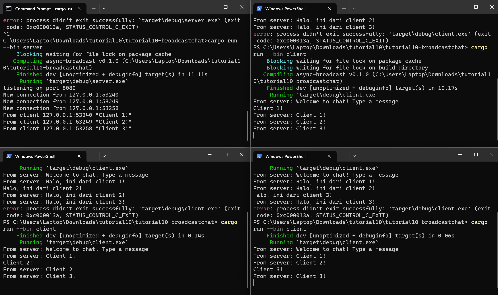
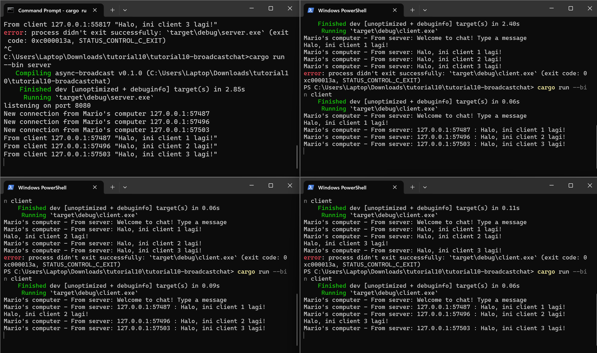

# REFLEKSI

##  2.1: Original code, and how it run

Cara menjalankan program tersebut adalah membuka direktori program di empat windows terminal, lalu menjalankan `cargo run --bin server` di salah satu terminal dan menjalankan `cargo run --bin client` di ketiga terminal lainnya. Yang terjadi ketika saya mengetik suatu teks pada clients adalah teks tersebut akan diterima oleh server dan server akan mengirimkannya ke setiap client yang terhubung dengannya (broadcast). Oleh karena itu pesan yang dikirim oleh satu client bisa sampai dan dilihat oleh client lainnya. Semua client tersebut dihubungkan oleh server.

## 2.2: Modifying port

Seperti yang bisa dilihat pada gambar, pengubahan port pada kedua sisi berhasil dan tetap bisa berjalan pada port baru. Pengubahan port dari `2000` menjadi `8080` dilakukan pada `client.rs` (sisi klien) dan `server.rs` (sisi server). Pengubahan pada sisi klien dilakukan pada `ClientBuilder` di line 10, sedangkan perubahan pada sisi server dilakukan pada pernyataan variabel `listener` dan `println` di line 44-45. File lain yang perlu dimodifikasi (server.rs) menggunakan websocket yang sama yaitu `tokio_websockets`.

## 2.3: Small changes, add IP and Port

Saya melakukan perubahan untuk klien pada `client.rs` line 23 dengan menambahkan `Mario's computer - ` pada awal kalimat print ln karena itu merupakan bagian yang mencetak informasi mengenai nama client dan user. Saya juga melakukan perubahan untuk server pada `server.rs` line 48 dengan menambahkan `Mario's computer` di tengah println karena bagian tersebut juga mencetak informasi mengenai IP client. Perubahan dilakukan agar informasi mengenai nama server dan client yang terhubung dapat dilihat pada terminal client dan server. Sebagai tambahan, pesan akan menampilkan informasi mengenai asal port Ia dikirim. Ini memungkinkan client lain mengetahui asal port pesan tersebut dikirim.