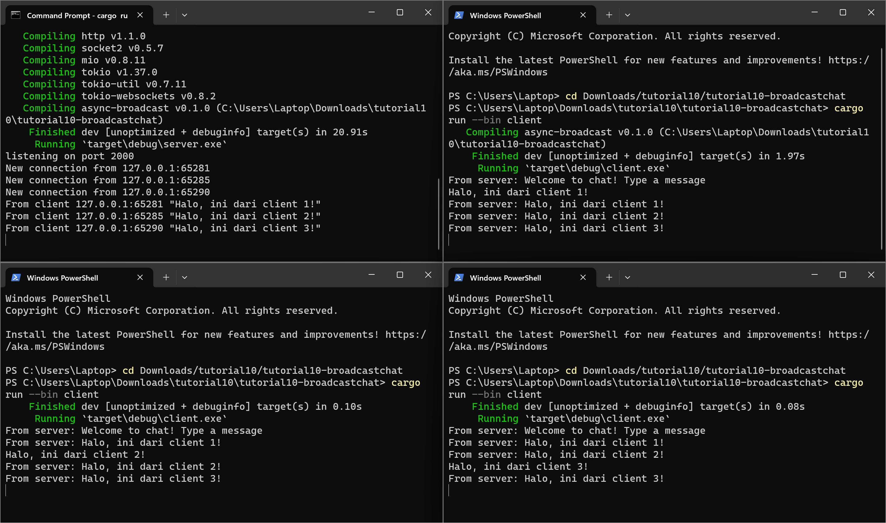

# REFLEKSI

##  2.1: Original code, and how it run

Cara menjalankan program tersebut adalah membuka direktori program di empat windows terminal, lalu menjalankan `cargo run --bin server` di salah satu terminal dan menjalankan `cargo run --bin client` di ketiga terminal lainnya. Yang terjadi ketika saya mengetik suatu teks pada clients adalah teks tersebut akan diterima oleh server dan server akan mengirimkannya ke setiap client yang terhubung dengannya (broadcast). Oleh karena itu pesan yang dikirim oleh satu client bisa sampai dan dilihat oleh client lainnya. Semua client tersebut dihubungkan oleh server.